

  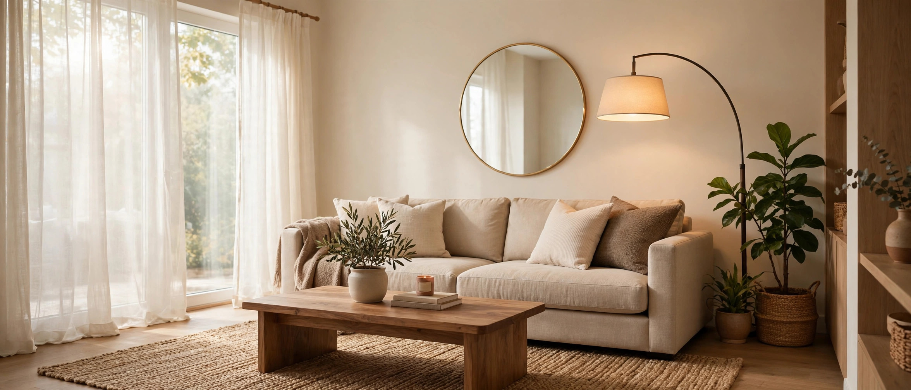

<h1 align="center">WoodNest</h1>

  <b>Furniture shopping, done right.</b> 
  Honest delivery dates. A fit checker that actually checks. Prices that don't lie.

  
  
  
  

---

## Why WoodNest?

Every furniture app promises the world and delivers excuses — late deliveries, fake MRPs, sofas that don't fit through the door. WoodNest was built to kill each of those pain points, one feature at a time.

- 📐 **"Will it fit?" checker** — enter your door and staircase width, we tell you *before* you buy whether it gets inside. Wrong call on our end? Free return, our promise.
- 📦 **Honest delivery dates** — a firm date shown *before* checkout, a time slot you pick, and a promise that never silently moves.
- 📉 **Price-drop alerts** — favorite anything and we'll ping you the moment its price falls. No fake "was ₹99,999" games.
- 📸 **Real customer photo reviews** — verified-buyer badges only on real orders. What you see is what someone's living room actually looks like.
- 🛋️ **Shop the Look bundles** — curated room sets with real bundle discounts, one tap to add the whole room.
- 🔑 **Rent-to-own** — every product with a monthly rent option and a fair buyout. Your money, your call.
- ♻️ **Old furniture exchange** — instant credit for your old sofa or bed, free pickup with delivery.
- 🎨 **Designer consults** — book a 30-min video call with an interior designer, right from checkout.
- 🔧 **Assembly booking** — carpenter slot booked with your delivery. No "bhaiya kal aayenge" stories.
- 🎬 **Reels** — shoppable makeover feed. See it, tap it, own it.
- 🎁 **Referrals + WoodNest Circle loyalty** — ₹500 for you and your friend, points on every order, tiers that actually reward.
- 🗺️ **Regional collections** — Sheesham classics for the North, light modular picks for the South.

Plus everything a store needs: cart, wishlist, search, order tracking with cancellation, saved addresses, and server-side billing that never trusts the client.

---

## The Collection

| | | |
|:---:|:---:|:---:|
| 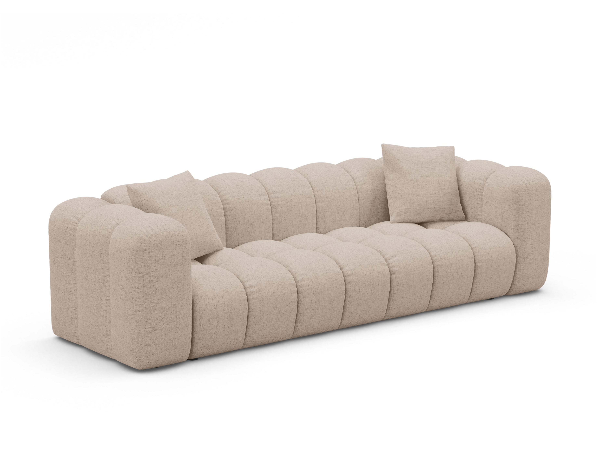 **Oslo 3-Seater Sofa** | 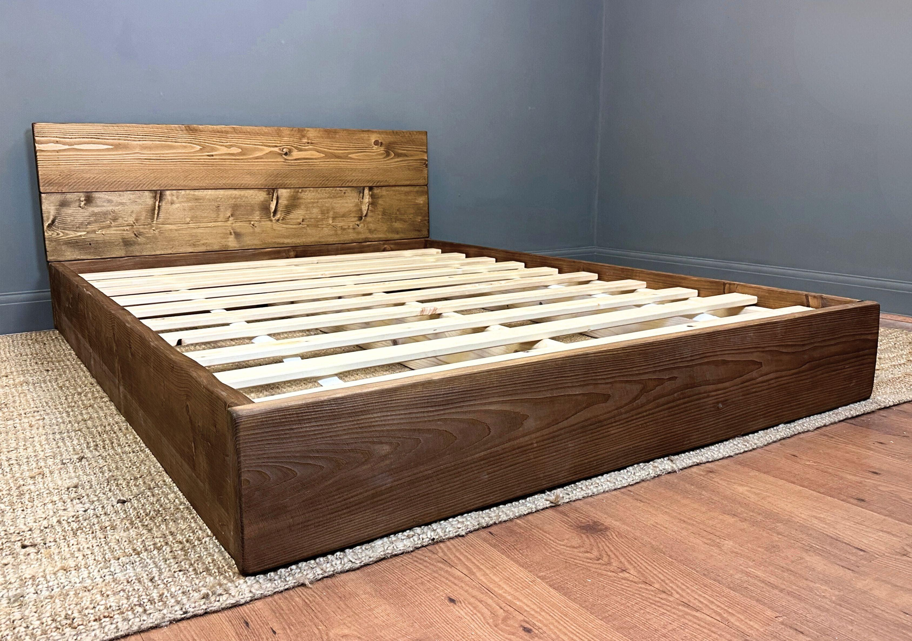 **Sheesham Bed Frame** | 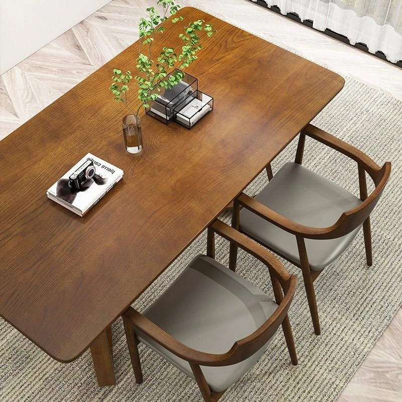 **Dining Table** |
| 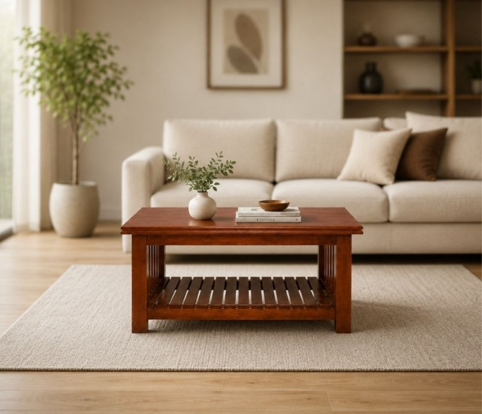 **Coffee Table** | 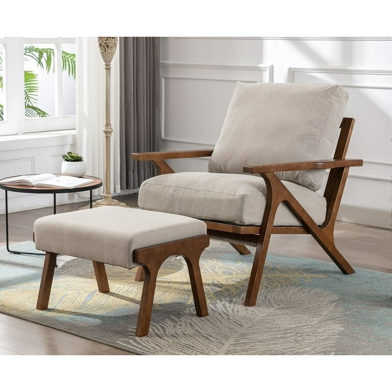 **Accent Chair** | 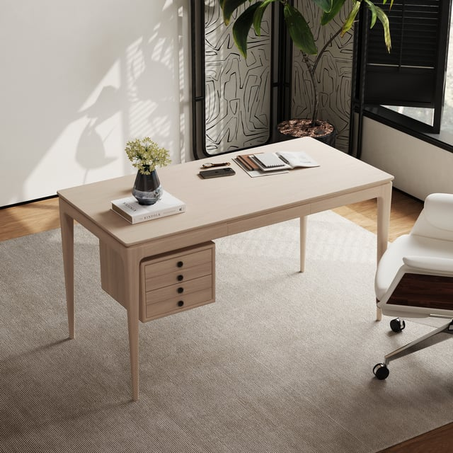 **Work Desk** |
| 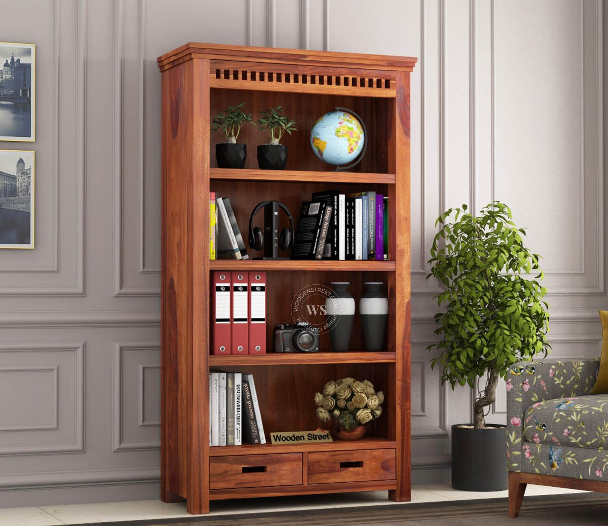 **Bookshelf** | 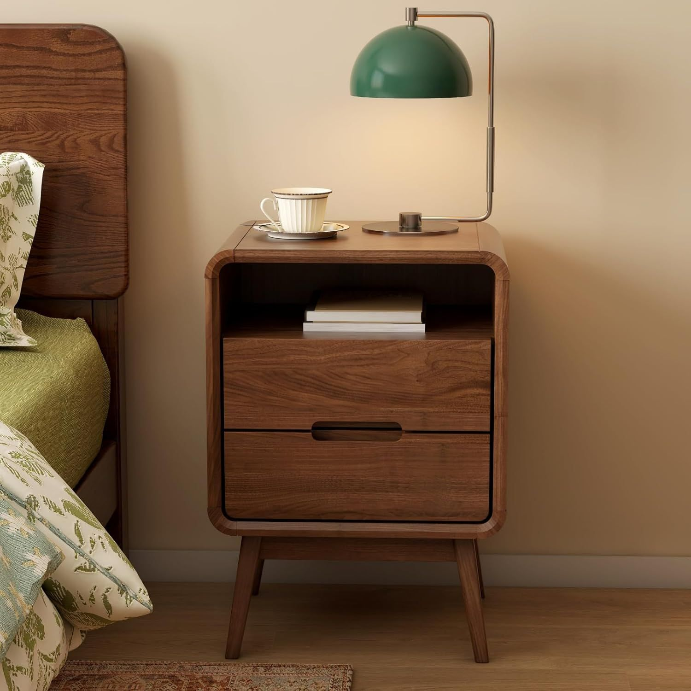 **Nightstand** | 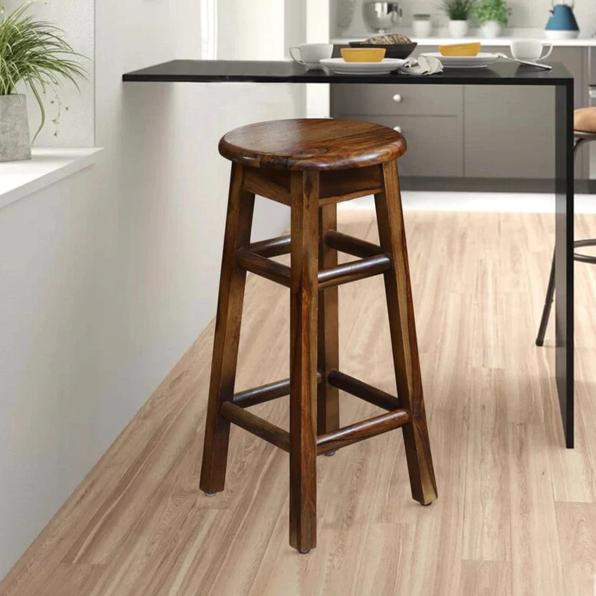 **Counter Stool** |
| 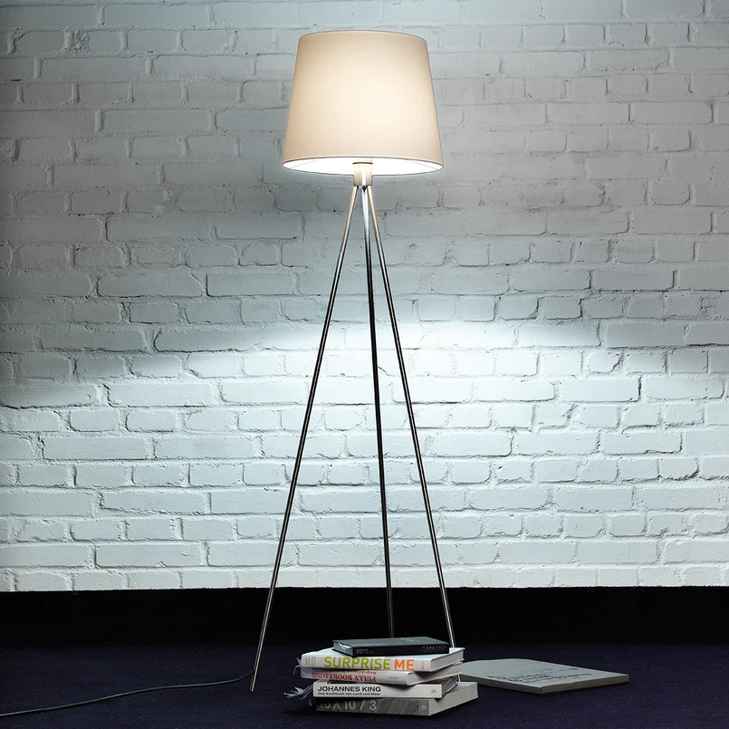 **Arc Floor Lamp** | 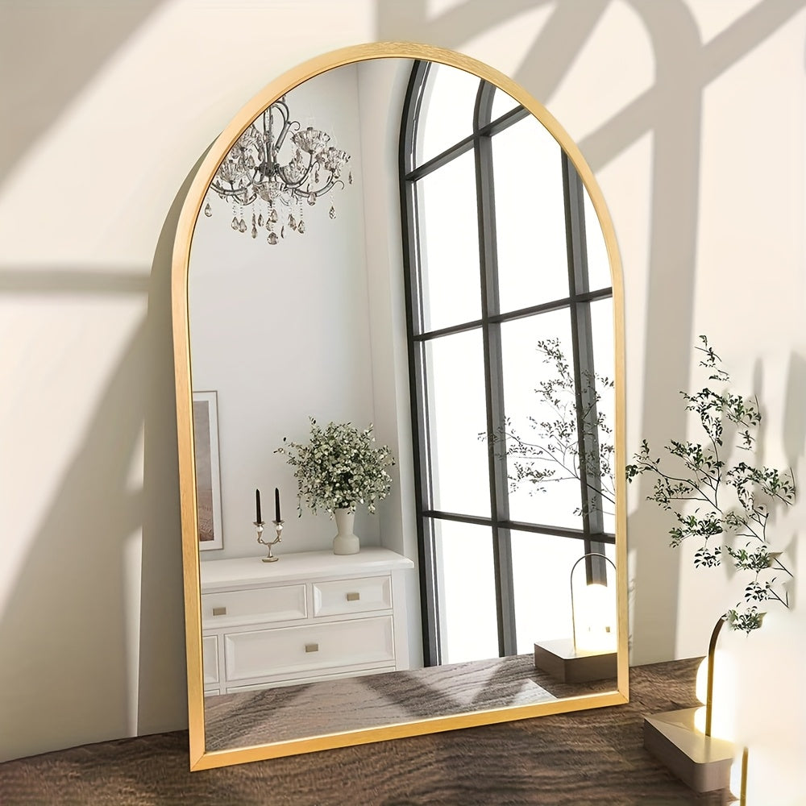 **Arch Mirror** |  **The WoodNest Look** |

  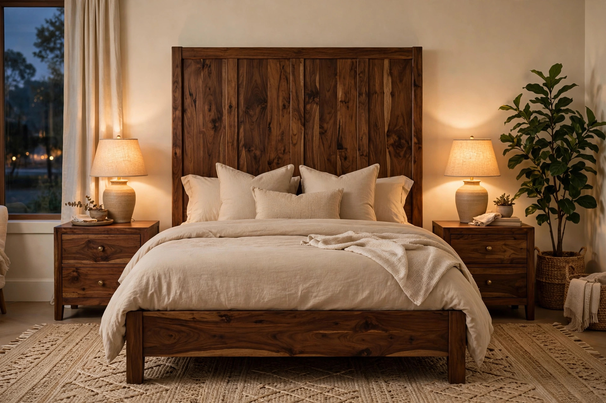
  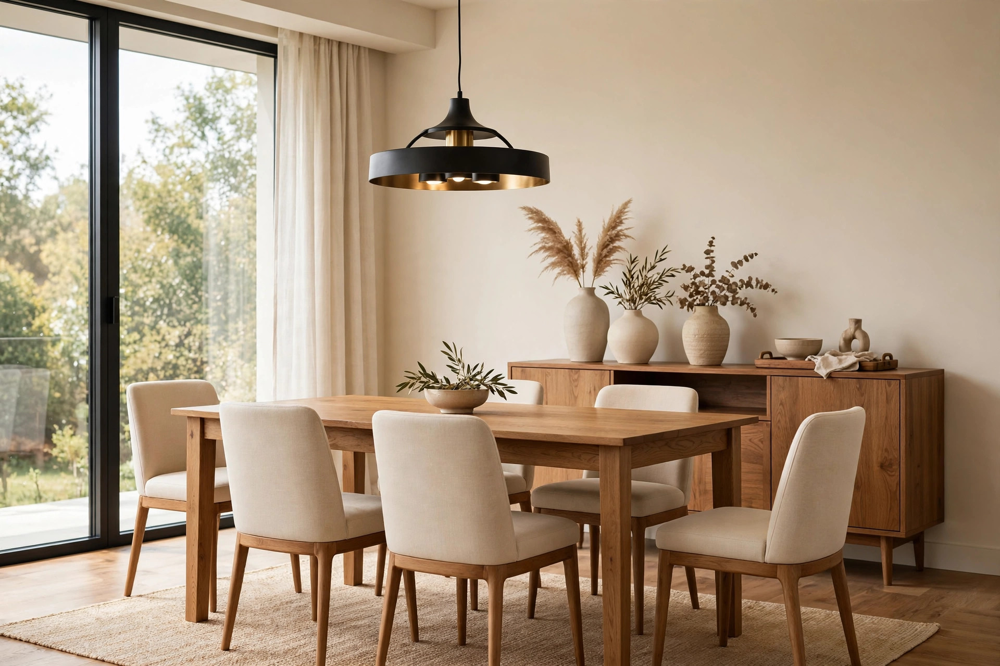

---

## Offers

| Code | Deal |
|:---|:---|
| `WELCOME10` | 10% off, up to ₹2,000 |
| `FLAT500` | ₹500 off above ₹9,999 |
| `FREESHIP` | Free delivery |
| `FESTIVE15` | 15% off above ₹24,999 |
| `REFBONUS500` | ₹500 referral reward |

All coupons validated server-side. No stacking tricks, no fine-print traps.

---

## Tech

- Full-stack web app — server-backed cart, orders, addresses, reviews, loyalty, and promos
- Every bill recomputed on the server; the client never decides a price
- Responsive, mobile-first UI in a warm coffee-brown design language

## Roadmap

- [ ] Real courier serviceability API for delivery promises
- [ ] True-scale AR room preview
- [ ] Razorpay live payments (currently demo checkout)
- [ ] Certified secondhand buyback loop

---

  <b>WoodNest</b> — ghar sajao, tension-free. 
  © kurupdevs. All rights reserved.

